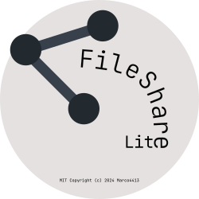

# FileShare Lite



## About

This is a small File Sharing Service.

**This is meant for Personal Use, which implies that it is not built to be fast and/or efficient.**

## Running

### First Time Setup

```sh
$ npm i
$ npm start
```

Once started for the first time a `config.json` file will be generated in the `data` folder.
It will contain credentials for the `admin` user and other settings.

You can enable `https` (this project relies only on `https` for security) by setting both `key` and `cert` to point to your
SSL private key and certificate.

**ONCE COMPLETED THE FIRST TIME SETUP, PLEASE WRITE DOWN THE ADMIN CREDENTIALS AND DELETE THE ENTRY FROM THE CONFIG FILE.**

### Subsequent Runs

```sh
$ npm start
```

## I forgot my admin credentials...

If you don't remember your credentials, you can create a new admin entry in the config file and restart the server.
Once restarted, a new admin account will be created with those credentials, you can use that to edit the other account's password,
and, once logged into the old account, you can delete the new one. Don't forget to then remove the entry from the config file.

## [PLEASE READ] What happens when I delete a user?

When a user is deleted, only its database entries and owned shares will be removed.
Files will still be accessible within its folder (`data/uploads/<USERID>`).
While highly unlikely, a new user could be generated with the same ID, and if the folder is not deleted, the new user could
access the deleted user's files.
